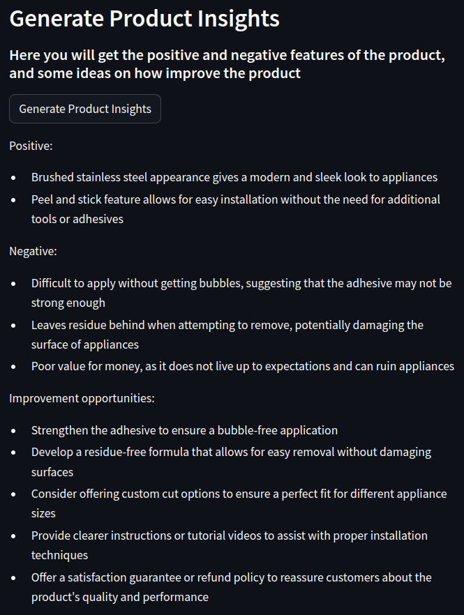
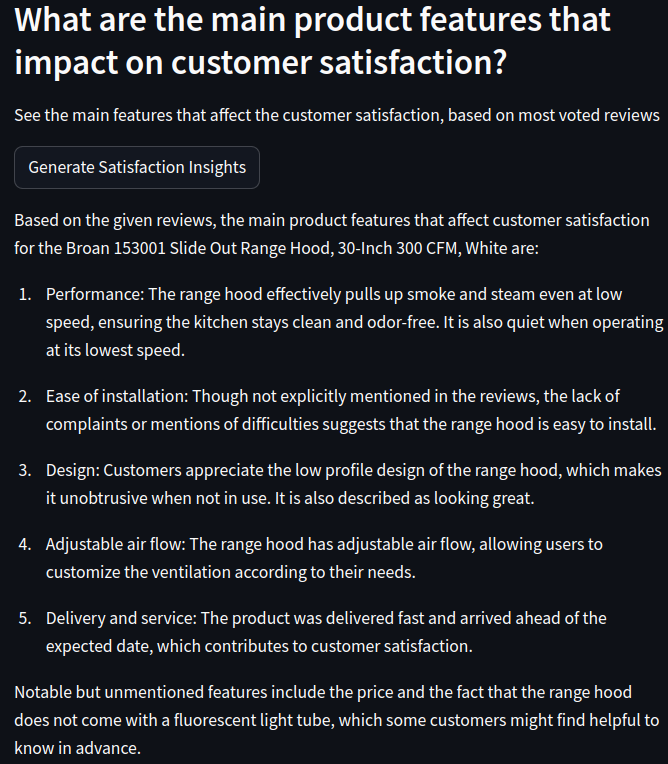
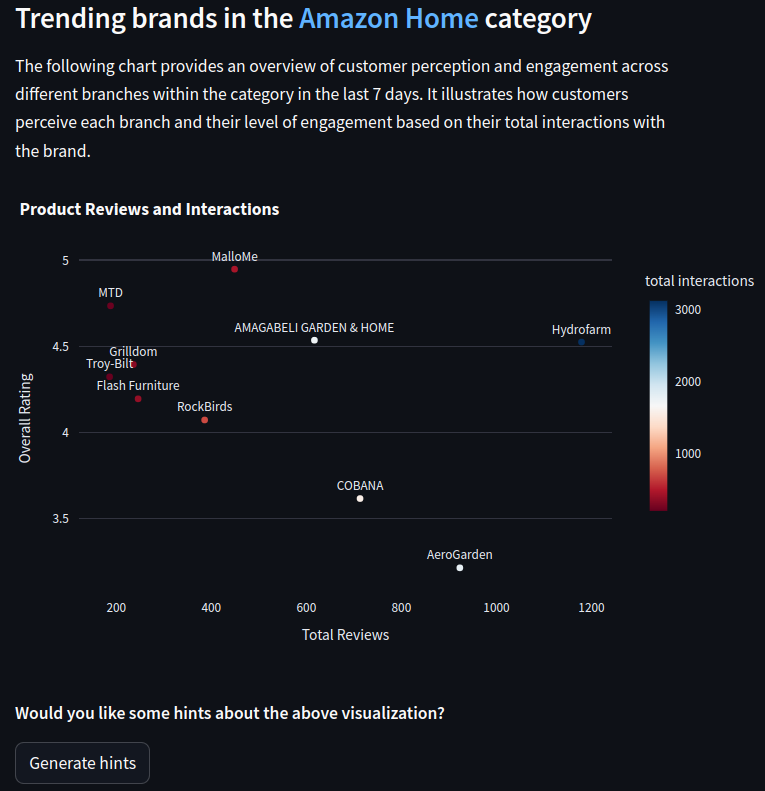

# Project name: *factored datathon 2023 - datacticos*

## Table of Contents 
- [Description](#description)
- [Features](#features)
- [Project Structure](#project-structure)
- [Deployment](#Deployment)
- [Screenshots](#Screenshots)

## Description 

The primary objective of this project is to create an analytical tool capable of aiding the decision-making process by leveraging Amazon reviews. The tool will empower users to grasp customers' sentiments regarding products, highlight essential insights from the extensive pool of Amazon reviews, and offer relevant indicators for comprehending product performance in the market.

## Features 

- **Check customer reviews in historical and streaming timeview.**
- **Automatic summarization of good or bad reviews on demand.**
- **Insights extraction from product reviews and identification of areas for improvement for each product..** 
- **A comprehensive set of analytics is provided to help you understand how customers perceive your brand and products.**
- **A collection of analytics is available to offer insights into trending products and brands based on the latest reviews and interactions data from the past few days.**

## Project Structure

The project is composed of different directories used in different stages during the development of the project

* DataPipeline: Contains the files regarding to the ETL process of the data.
* DownloadData: Files used to download the batch data from the azure datalake.
* EDA: Contains different exploratory data analysis useful to understand the nature of the data.
* Frontend: Main folder of the project, it contains all the programing logic to develop the products and make it available through a streamlit application.
* Models: Contains the tests of the different models used during the summarization tasks of the project.
* Streaming: Files used to get the streaming data.

## Deployment
You can take a look of the final product here: https://datacticos-datathon.azurewebsites.net/

## Screenshots 
* Image 1

*Here's an illustration showcasing the capabilities of our tool, providing valuable insights into product reviews.*

* Image 2

*This image demonstrates how our tool can identify the key factors contributing to customer satisfaction or dissatisfaction with a specific product.*

* Image 3

*In this example, our tool enables you to analyze various companies within a sector and their interactions with customers.*

## The team

* [@YhBedoya](https://github.com/YhBedoya)
* [@ceronvgabriel](https://github.com/ceronvgabriel)
* [@diegoecon-ai](https://github.com/diegoecon-ai)
